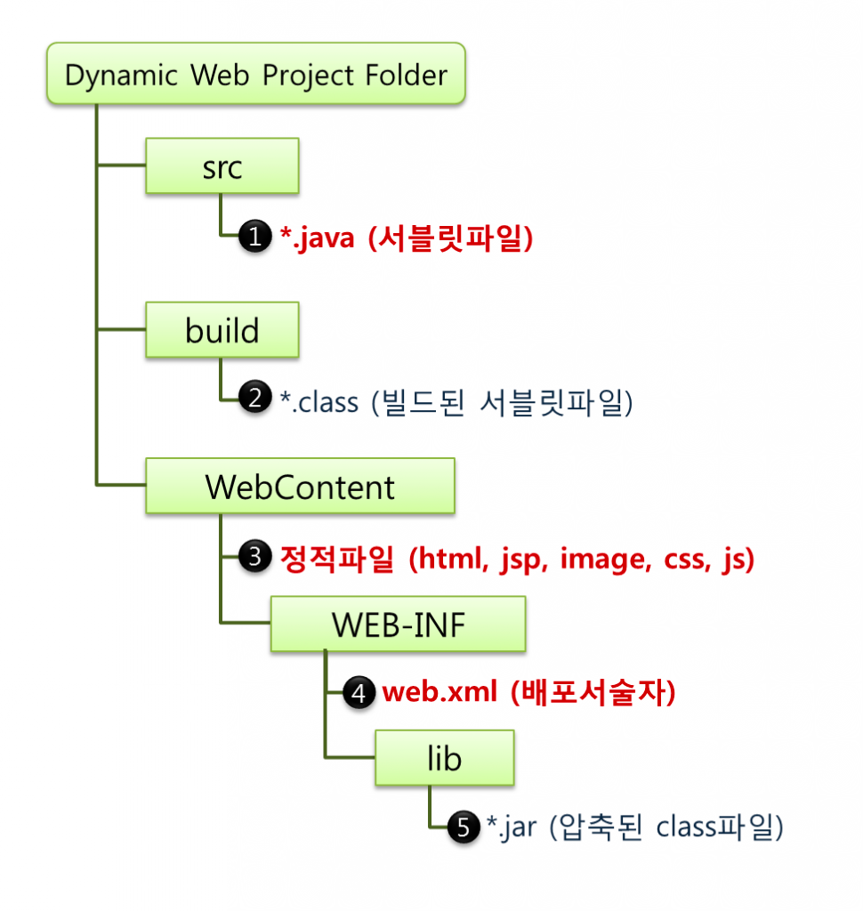
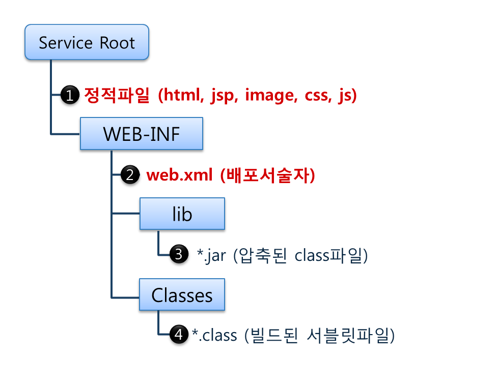
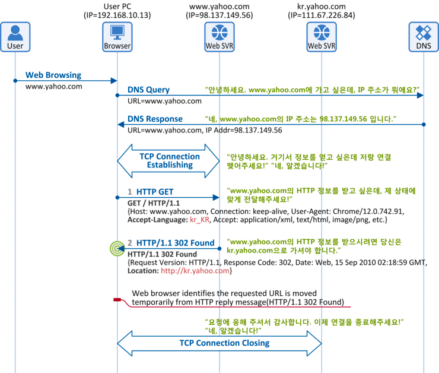

# java-was-2022
Java Web Application Server 2022

## 프로젝트 정보 

이 프로젝트는 우아한 테크코스 박재성님의 허가를 받아 https://github.com/woowacourse/jwp-was 
를 참고하여 작성되었습니다.

### 프로젝트 구조
    ├─src/main/java
    │  ├─java
    │  │  ├─customException
    │  │  │  │  AlreadyHasSameIdException.java
    │  │  │  │  
    │  │  │  └─cannotLogIn
    │  │  │          CannotLogInException.java
    │  │  │          NotFoundUserException.java
    │  │  │          PasswordMismatchException.java
    │  │  │          
    │  │  ├─db
    │  │  │      Database.java
    │  │  │      UserIdSession.java
    │  │  │      
    │  │  ├─model
    │  │  │      User.java
    │  │  │      
    │  │  ├─utils
    │  │  │      SessionIdGenerator.java
    │  │  │      
    │  │  └─webserver
    │  │      │  RequestHandler.java
    │  │      │  WebServer.java
    │  │      │  
    │  │      ├─constants
    │  │      │      InBody.java
    │  │      │      Paths.java
    │  │      │      
    │  │      ├─controller
    │  │      │      Controller.java
    │  │      │      ControllerMapper.java
    │  │      │      DynamicFileController.java
    │  │      │      StaticFileController.java
    │  │      │      
    │  │      ├─httpUtils
    │  │      │  │  Request.java
    │  │      │  │  RequestGetter.java
    │  │      │  │  Response.java
    │  │      │  │  ResponseSender.java
    │  │      │  │  
    │  │      │  └─entity
    │  │      │          Body.java
    │  │      │          Header.java
    │  │      │          ReqLine.java
    │  │      │          ResLine.java
    │  │      │          
    │  │      └─service
    │  │              AlreadyLoggedInService.java
    │  │              InvalidAccesstoUserListService.java
    │  │              LogInService.java
    │  │              Service.java
    │  │              SignUpService.java
    │  │              UserListService.java
    │  │              
    │  └─resources
    │      │  logback.xml
    │      │  
    │      ├─static
    │      │  ├─css
    │      │  │      bootstrap.min.css
    │      │  │      styles.css
    │      │  │      
    │      │  ├─fonts
    │      │  │      glyphicons-halflings-regular.eot
    │      │  │      glyphicons-halflings-regular.svg
    │      │  │      glyphicons-halflings-regular.ttf
    │      │  │      glyphicons-halflings-regular.woff
    │      │  │      glyphicons-halflings-regular.woff2
    │      │  │      
    │      │  ├─images
    │      │  │      80-text.png
    │      │  │      
    │      │  └─js
    │      │          bootstrap.min.js
    │      │          jquery-2.2.0.min.js
    │      │          scripts.js
    │      │          
    │      └─templates
    │          │  favicon.ico
    │          │  index.html
    │          │  
    │          ├─qna
    │          │      form.html
    │          │      show.html
    │          │      
    │          └─user
    │                  form.html
    │                  form_failed.html
    │                  list.html
    │                  login.html
    │                  login_failed.html
    │                  profile.html

- customException
  - AreadyHasSameIdException : 이미 디비에 저장된 아이디로 회원가입 요청이 들어올 경우 던져지는 예외.
  - CannotLogInException : 로그인할 수 없을 때 던져지는 예외. 아래 두 클래스는 이 클래스를 상속받는다.
    - NotFoundUserException : 디비에 없는 아이디로 로그인 요청이 들어올 경우 던져지는 예외.
    - PasswordMismatchException : 아이디는 맞지만, 비밀번호가 디비에 저장되어있는 것과 다를 때 던져지는 예외.
- db
  - 유저에 관한 정보가 저장되어 있는 디비와 세션
- model
  - User : 유저 관련
- utils
  - SessionIdGenerator : 세션아이디를 만들어주는 클래스
- webserver : 웹 서버 관련 객체들이 들어있는 패키지
  - controller : 컨트롤러 관련 클래스와 인터페이스가 들어있음
  - httpUtils : http req, res와 그와 관련된 클래스들이 들어있음
  - service : 실제로 서비스가 이루어지는 클래스. 모든 서비스들은 Service 인터페이스를 상속받는다.

### 실행 과정 요약 
- WebServer : 소켓 생성 및 클라이언트 대기
- RequestHandler : http request(이하 요청)를 받고 알맞은 컨트롤러로 요청을 넘김
- Controller : 요청 내용에 따라 서비스 객체에게 서비스를 실행하라고 명령함
  - Service : 요청 내용에 맞는 서비스를 실행한 후 컨트롤러에게 응답(response)함
  - 서비스 객체가 응답을 하면, 컨트롤러는 ResponseSender에게 응답을 클라이언트에게 전해달라고 요청
- ResponseSender : 받은 응답을 클라이언트에게 전송함.

## 알게된 것 정리

### HTTP
hyperText인 html을 전송하기 위한 통신규약
- 웹 상에서 클라이언트와 서버 간의 request, response 정보에 대한 프로토콜
- connectionless
- stateless
- tcp와 udp를 사용하며, 80번 포트
### HTTP 동작방식

1. 사용자가 브라우저에 URL을 입력한다.
2. 브라우저가 request 메시지를 보낸다(http request)
3. 서버는 메시지를 바탕으로 정해진 일을 수행한다.
4. 서버가 response 메시지를 보낸다(http response)
5. 브라우저가 메시지를 바탕으로 일을 처리한다.

(실제로는 DNS 처리도 이뤄져야 함)

### HTTP Request
HTTP Request Message = Request Line + Request Header + Request Body

- Request Line

  요청 메소드 + 요청 URI + HTTP 프로토콜 버전으로 이루어져 있음.
- Request Header

  key:value값으로 메타데이터들이 전달됨.

  [헤더 key:value 정보](https://developer.mozilla.org/ko/docs/Web/HTTP/Headers)
- Body

    해당 request의 실제 내용. GET, HEAD, DELETE, OPTIONS처럼 리소스를 가져오는 경우 바디가 없기도 함.

### HTTP Response
HTTP Response Message = Status Line + Response Header + Response Body

- Status Line
  - HTTP 버전
  - Status code: 응답 상태를 나타내는 코드. [HTTP Status Code](https://developer.mozilla.org/en-US/docs/Web/HTTP/Status)
  - Status text: 응답 상태를 간략하게 설명해주는 부분.

- Response Header
    
    request header와 거의 동일
  
    [헤더 key:value 정보](https://developer.mozilla.org/ko/docs/Web/HTTP/Headers)
  
- Body

    request body와 거의 동일. 데이터를 전송할 필요가 없는 경우 마찬가지로 body가 존재하지 않음

### 자바 웹 프로젝트 상대경로에 대하여
웹 백엔드 개발 시, 프론트엔드에서 사용하는 경로의 루트가 벡엔드에서 사용하는 루트와 다름에 주의하자.
- IDE에서 보이는 경로
 

- 프론트엔드에서 보이는 경로

[사진 출처](https://myblog.opendocs.co.kr/archives/436) 현 프로젝트의 구조와 다릅니다. 참고용으로만 보시길 바랍니다.

전자의 루트는 IDE에서 보이는 프로젝트 폴더이지만, 후자의 루트는 정적파일들이 들어있는 폴더이다.

### html에서 자동 redirect
html 문서의 head에서 meta태그 안에 다음과 같은 정보를 주면 해당 파일이 브라우저에 띄워진 후, 명시된 곳으로 redirect된다.

### HTTP code 30x을 사용한 redirect
서버가 브라우저에게 HTTP res code를 300번대로 지정하고, Location에 원하는 경로명을 value로 넣은 후 전송하면

브라우저가 정보를 해독해 다시 request를 보낸다. 서버에서는 이를 처리하여 알맞은 html파일을 브라우저에 전송하면 redirect의 효과를 얻을 수 있다.

자주 사용하는 300번대 code + text
- 301 Moved Permanently

  영구적으로 주소가 이동한 경우
- 302 Found

  브라우저가 요청했던 uri가 일시적으로 변경된 경우

302 Found 메시지가 어떤 과정을 거쳐 전달되는지 도식화
[출처](https://m.blog.naver.com/PostView.naver?isHttpsRedirect=true&blogId=netmaniascom&logNo=80138330596)

### 확장자를 마임타입(content type)으로 쉽게 변환하는 법

- Files 클래스의 probeContentType() 메서드
- URLConnection 클래스의 guessContentTypeFromName() 메서드
- MimetypesFileTypeMap 객체의 getContentType() 메서드

### Stateless vs Stateful
- Stateless

Stateless는 과거의 transaction에 대한 기록이나 정보가 없는 것을 의미한다(현재의 transaction이 과거와 독립적임). 각각의 transaction은 마치 처음 일어나는 것처럼 만들어진다. 한 transaction 당 하나의 서비스나 기능을 제공한다(Short-term request).

예를 들자면, 검색엔진을 들 수 있다. 검색창에 타이핑을 하고 엔터키를 눌렀다고 가정하자. 이 과정에서 인터럽트가 발생하거나, 브라우저가 닫히게 되면 사용자는 처음부터 다시 transaction을 만들어야만 한다. 다른 예시로는 자판기가 있다.(single request - single response)
- Stateful

반면에 Stateful은 현재의 transaction이 과거의 transaction의 맥락을 따라 수행되는 것, 즉 과거의 transaction 기록에 영향을 받을 수 있다는 것을 의미한다. 이러한 이유 때문에 stateful app은 사용자로부터 받은 요청을 처리할 때마다 같은 server를 사용한다.

Stateful의  예시를 들자면 이메일을 들 수 있을 것이다. 이메일의 경우 첫 전송을 제외하면 나머지 transaction들은 이전에 송수신되었던 내용 뒤에 답장을 붙이는 식으로 진행된다. 이러한 특성 때문에, 중간에 인터럽트가 발생했다 하더라도 현재까지의 기록을 통하여 적절히 취사선택을 할 수 있다.

[참고자료](https://www.redhat.com/en/topics/cloud-native-apps/stateful-vs-stateless)

