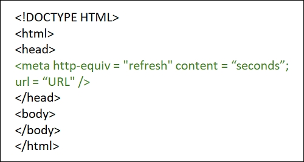

# java-was-2022
Java Web Application Server 2022

## 프로젝트 정보 

이 프로젝트는 우아한 테크코스 박재성님의 허가를 받아 https://github.com/woowacourse/jwp-was 
를 참고하여 작성되었습니다.

## 알게된 것 정리

### HTTP
hyperText인 html을 전송하기 위한 통신규약
- 웹 상에서 클라이언트와 서버 간의 request, response 정보에 대한 프로토콜
- connectionless
- stateless
- tcp와 udp를 사용하며, 80번 포트
### HTTP 동작방식

1. 사용자가 브라우저에 URL을 입력한다.
2. 브라우저가 request 메시지를 보낸다(http request)
3. 서버는 메시지를 바탕으로 정해진 일을 수행한다.
4. 서버가 response 메시지를 보낸다(http response)
5. 브라우저가 메시지를 바탕으로 일을 처리한다.

(실제로는 DNS 처리도 이뤄져야 함)

### HTTP Request
HTTP Request Message = Request Line + Request Header + Request Body

- Request Line

  요청 메소드 + 요청 URI + HTTP 프로토콜 버전으로 이루어져 있음.
- Request Header

  key:value값으로 메타데이터들이 전달됨.

  [헤더 key:value 정보](https://developer.mozilla.org/ko/docs/Web/HTTP/Headers)
- Body

    해당 request의 실제 내용. GET, HEAD, DELETE, OPTIONS처럼 리소스를 가져오는 경우 바디가 없기도 함.

### HTTP Response
HTTP Response Message = Status Line + Response Header + Response Body

- Status Line
  - HTTP 버전
  - Status code: 응답 상태를 나타내는 코드. [HTTP Status Code](https://developer.mozilla.org/en-US/docs/Web/HTTP/Status)
  - Status text: 응답 상태를 간략하게 설명해주는 부분.

- Response Header
    
    request header와 거의 동일
  
    [헤더 key:value 정보](https://developer.mozilla.org/ko/docs/Web/HTTP/Headers)
  
- Body

    request body와 거의 동일. 데이터를 전송할 필요가 없는 경우 마찬가지로 body가 존재하지 않음

### 자바 웹 프로젝트 상대경로에 대하여
웹 백엔드 개발 시, 프론트엔드에서 사용하는 경로의 루트가 벡엔드에서 사용하는 루트와 다름에 주의하자.
- IDE에서 보이는 경로
 

- 프론트엔드에서 보이는 경로

[사진 출처](https://myblog.opendocs.co.kr/archives/436) 현 프로젝트의 구조와 다릅니다. 참고용으로만 보시길 바랍니다.

전자의 루트는 IDE에서 보이는 프로젝트 폴더이지만, 후자의 루트는 정적파일들이 들어있는 폴더이다.

### html에서 자동 redirect
html 문서의 head에서 meta태그 안에 다음과 같은 정보를 주면 해당 파일이 브라우저에 띄워진 후, 명시된 곳으로 redirect된다.

### HTTP code 30x을 사용한 redirect
서버가 브라우저에게 HTTP res code를 300번대로 지정하고, Location에 원하는 경로명을 value로 넣은 후 전송하면

브라우저가 정보를 해독해 다시 request를 보낸다. 서버에서는 이를 처리하여 알맞은 html파일을 브라우저에 전송하면 redirect의 효과를 얻을 수 있다.

자주 사용하는 300번대 code + text
- 301 Moved Permanently

  영구적으로 주소가 이동한 경우
- 302 Found

  브라우저가 요청했던 uri가 일시적으로 변경된 경우

### 확장자를 마임타입(content type)으로 쉽게 변환하는 법

- Files 클래스의 probeContentType() 메서드
- URLConnection 클래스의 guessContentTypeFromName() 메서드
- MimetypesFileTypeMap 객체의 getContentType() 메서드
